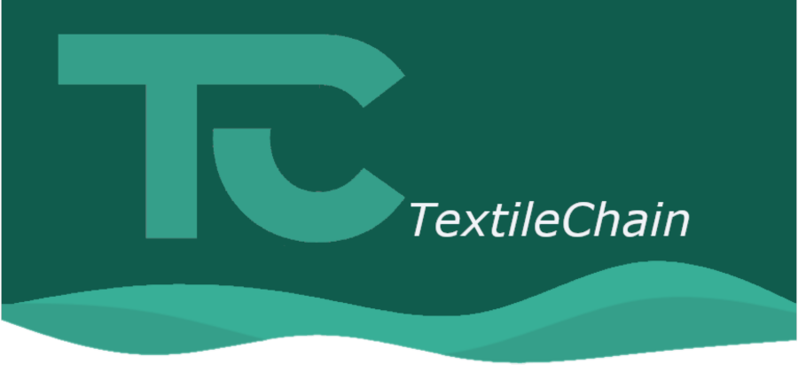

<h1 align="center">TextileChain </h1>

    

TextileChain is a cross platform DApp that demonstrates the use of a web3 supply chain maagement system in the context of textile industry. The app allows the manufacturer to upload the primary resources (such as cotton, linen...) along with their production information to an Ethereum blockchain and then create a final product (such as trousers, tshirts,...) using the aforementioned materials; a QR code associated to each garment added in the blockchain is generated and uploaded on Firebase storage. The QR code points to the Ethereum address of the product and can be verified trough the application in order to determine its authenticity.

The app can be integrated with a textile quality control autonomous system that embeds a deep neural network, which scans the textile (ideally) in the industry checking for defects, then if it doen't find defects the textile a message is uploaded on IOTA ledger with a verification ID which proves that the primary resource is in fact detected as defectless. This contributes to make not counterfeitable the data uploaded in the blockchain.

## Technologies deployed:
- Solidity
- Truffle
- Ganache 
- Web3Dart
- Dart
- Flutter
